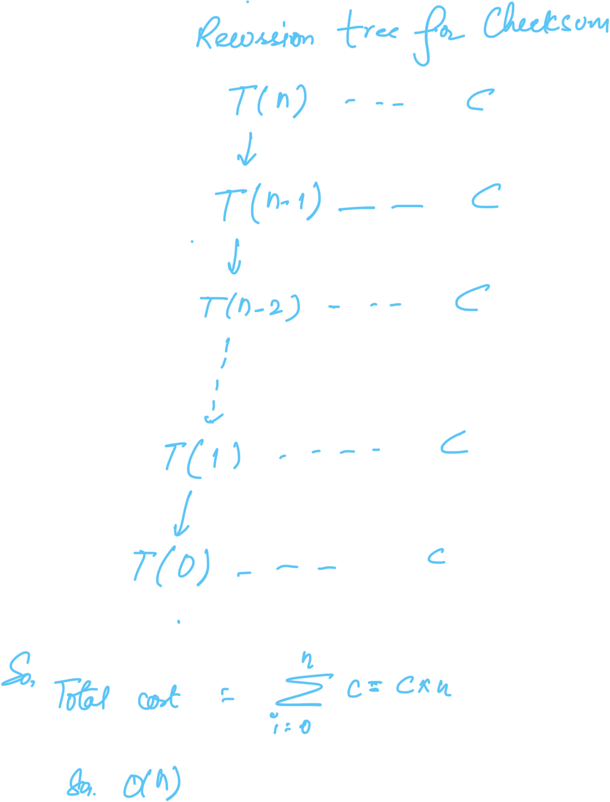

<h2 id="org6f72e3b">Information</h2>

<ul class="org-ul">
<li>Name: [Checksum]</li>
<li>Link: [<a href="http://leetcode.com/problems/two-sum-ii-input-array-is-sorted/description/">http://leetcode.com/problems/two-sum-ii-input-array-is-sorted/description/</a>]</li>
<li>Difficulty: [Medium]</li>
<li>Date: &lt;2025-09-23 Tue&gt;</li>
<li>Problem Type:Array</li>
</ul>

<h2 id="org0b7e46f">Problem Decription</h2>

For a sorted array A and a number s, find whether there are two entries in A which sum up to s.

<h2 id="org71dfec1">Approach &amp; Code</h2>

<ul class="org-ul">
<li>Array A is an sorted array.</li>
<li>Entries can be positive and nrgative integers.</li>
<li>Sum s to be sum of two entries from the array.</li>
<li>Same entry can be added twice to get the sum.</li>
</ul>

<h3 id="orgf6f0aca">Approach 1: Exhaustive Approach</h3>

<pre class="example" id="orgfc35f28">
Checksum(A,s)
  //A is an sorted array of numbers.
  //s is the sum to be checked
  n = A.length
  for(i = 1 ; i &lt;= n; i++)
    for(j = i; j&lt;= n; j++)
      sum = A[i] + A[j]
      if(sum == s)
        return true
  return false

</pre>

<pre class="src src-python">def checksum(A, s):
    """
    Checks if two entries in a sorted array A sum up to s.

    This is a literal translation of the provided pseudocode.
    Note: The original pseudocode uses 1-based indexing (i from 1 to n).
    Python uses 0-based indexing (0 to n-1), so the array access is A[i-1] and A[j-1].
    """
    # A is a sorted list of numbers.
    # s is the sum to be checked
    n = len(A)
    for i in range(1, n + 1):
      for j in range(i, n + 1):
        # Adjust for Python's 0-based indexing
        current_sum = A[i-1] + A[j-1]
        if current_sum == s:
          return True
    return False
my_array = [1, 2, 4, 7, 8, 11]
target_sum_1 = 10 # (2 + 8)
target_sum_2 = 15 # (4 + 11)
print(checksum(my_array,target_sum_1))
</pre>

<pre class="example">
True
</pre>

<h4 id="org76173a8">Problem Complexity</h4>

<ul class="org-ul">
<li>Time Complexity: O(n2)
<ul class="org-ul">
<li>As there is nested loop to compare the sum.</li>
</ul></li>
<li>Space Complexity: O(1)</li>
</ul>

<h4 id="orge82b17f">Key Takeaway / Learning</h4>

<h3 id="org8d9301d">Approach 2: Iteratice Approach</h3>

<ul class="org-ul">
<li>A better approach then the exhaustive approach utilizing the fact that the
array is sorted.</li>
</ul>
<pre class="example" id="org565d0a7">
Checksum(A,s)
  //A is an sorted array of numbers.
  //s is the sum to be checked
  right = A.length
  left = 1
  while (left &lt;= right):
      sum = A[left] + A[right]
      if(sum == s):
        return true
      elseif(sum &lt; s):
        left ++
      else
        right --
  return false
</pre>

<pre class="src src-python">def checksum(A, s):
  # A is a sorted list of numbers.
  # s is the sum to be checked
  right = len(A)-1
  left = 0
  print(left,right, A[left],A[right])

  while left &lt;= right:
    # This line will cause an IndexError because 'right' is out of bounds.
    print( A[left] , A[right])
    current_sum = A[left] + A[right]

    if current_sum == s:
      return True
    elif current_sum &lt; s:
      left += 1
    else:
      # This logic is also from the pseudocode.
      right -= 1

  return False

# --- Example Usage ---
# Note: Running this code will raise an IndexError immediately.
my_array = [1, 2, 4, 7, 8, 11]
target_sum = 16

try:
    print(checksum(my_array, target_sum))
except IndexError as e:
    print(f"Code failed as expected with an error: {e}")
</pre>

<pre class="example">
0 5 1 11
1 11
2 11
4 11
7 11
7 8
8 8
True
</pre>

<h4 id="org9fba398">Problem Complexity</h4>

<ul class="org-ul">
<li>Time Complexity: O(n)
<ul class="org-ul">
<li>As we only pass through a element once for the problem completion.</li>
</ul></li>
<li>Space Complexity: O(1)</li>
</ul>

<h4 id="orgb66c93a">Key Takeaway / Learning</h4>

<ul class="org-ul">
<li>As the array is sorted, the arrangement of number will be such that the sum
will be most likely from the left and right of the center.</li>
<li>If the current sum is less then we must move towards the larger number that is
move the left index towards the center</li>
<li>Id the current sum is larger then we need smaller number which is the number
left to the current right index, so decrease the right index towards the mid.</li>
</ul>

<h3 id="org8491f95">Approach 3: Recursive Approach</h3>

The iterative approach above gives an insight of the  key operation for each step.

<ul class="org-ul">
<li>We need the whole array,final sum, and two index to check the sum for it.</li>
<li>If we found the sum then the termination step is reached.</li>
<li>If not then we can use the current index to call for the next iteration with
new fresh index to look for.</li>
</ul>
<pre class="example" id="org9ed7e0a">
Checksum(A,s,left,right)
  //A is an sorted array of numbers.
  //s is the sum to be checked
  //left is the value of left index
  //right is the value of right index
  if(left &gt; right):
    return false
  sum = A[left] + A[right]
  if(sum == s):
    return true
  elseif(sum &lt; s):
    return Checksum(A,s,left++,right)
  else
    return Checksum(A,s,left,right--)
Checksum(A,s,1,A.length)
</pre>

<pre class="src src-python">def checksum(A,s,left,right):
  #A is an sorted array of numbers.
  #s is the sum to be checked
  #left is the value of left index
  #right is the value of right index
  if(left &gt; right):
    return False
  val = A[left] + A[right]
  print(left,right,A[left] ,A[right],val)
  if(val == s):
    return True
  elif(val &lt; s):
    return checksum(A,s,left+1,right)
  else:
    return checksum(A,s,left,right-1)
my_array = [1, 2, 4, 7, 8, 11]
target_sum = 16

try:
    print(checksum(my_array, target_sum,0,len(my_array)-1))
except IndexError as e:
    print(f"Code failed as expected with an error: {e}")

</pre>

<pre class="example">
0 5 1 11 12
1 5 2 11 13
2 5 4 11 15
3 5 7 11 18
3 4 7 8 15
4 4 8 8 16
True
</pre>

<h4 id="org37b5c80">Problem Complexity</h4>

<ul class="org-ul">
<li>Time Complexity: O(n)</li>
</ul>

<ul class="org-ul">
<li>Space Complexity: O(1)</li>
</ul>

<h4 id="org79ced8b">Key Takeaway / Learning</h4>

